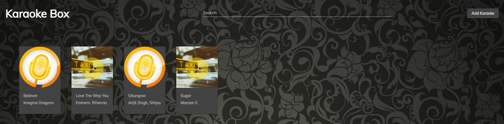

# NgxKaraoke

## Techstack:
- Angular
- .Net Core 2.2
- Postgres 12
- Web Speech API

## To get started
- Setup backend api, build the dotnet app and migrate a single model db onto your postgres instance. You can find the solution in `server/`.
- Once the app is started, get the api_url(something like https://localhost:port/api) and replace the string in `src/environments/environment.ts`.
- Start the angular app using `ng serve`. Ideally, the app would start on http://localhost:4200.
- To add songs, add mp3 files and .lrc format for lyrics. Set th offset value correctly and there you go, all set!!

## Hosting Tips
- I have hosted the entire stack on IIS 10. This way I do not have to run my projects when using this.
- You can use any db as long as dotnet ef supports it. Just need to make minor changes in `server/Startup.cs` for db connections.

PS: I have tested this on Chrome Version 80.0.3987.163 (Official Build) (64-bit). Not sure how it works on other browsers. Let me know on the issue board.

